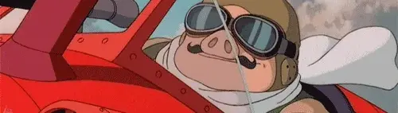

  

<h1 align="center">Hi 👋 I'm Marco Mistretta!</h1>

I’m passionate about Artificial Intelligence and its impact on how we interact with the world around us. My background in **Computer Engineering** and **AI** led me to pursue a PhD at MICC in Florence, Italy, under the esteemed supervision of Prof. Andrew D. Bagdanov. Now I’m diving deep into the world of **Multimodal Vision-Language Models** and their applications in solving real-world challenges.

## 🥇 First Author Publications:

- [**Improving Zero-shot Generalization of Learned Prompts via Unsupervised Knowledge Distillation**](https://arxiv.org/abs/2407.03056)  
  *ECCV 2024 (main paper)*  
  **Authors**: Marco Mistretta*, Alberto Baldrati*, Marco Bertini, Andrew D. Bagdanov  
  **Code**: [GitHub Repository](https://github.com/miccunifi/KDPL)

- [**RE-tune: Incremental Fine Tuning of Biomedical Vision-Language Models for Multi-label Chest X-ray Classification**](https://arxiv.org/abs/2410.17827)  
  *NeurIPS 2023, Medical Imaging meets NeurIPS Workshop*  
  **Authors**: Marco Mistretta, Andrew D. Bagdanov

## 🌟 What Drives Me:
I'm really into:
- 🧠 **Multimodal Learning**: Combining visual and language data to get a richer understanding of the world.
- 💬 **Natural Language Processing (NLP)**: Teaching machines to understand and communicate in human language.
- 🖼️ **Contrastive Self-Supervised Learning**: Finding patterns in data without the need for human labels.
- ♻️ **Incremental Learning**: Allowing AI models to keep learning from new information without forgetting the old ones.
- 🎯 **Few-Shot Adaptation**: Quickly adapting AI to a diverse data distribution with minimal examples.
- 📝 **Prompt Learning**: Tuning only a few learnable parameters, so-called "prompts", to maximize VLMs performance.
- 🚀 **Test-Time Adaptation**: Letting models adjust during inference to handle unseen data on the fly.

## 📝 Recent Publications:
- [**Improving Zero-shot Generalization of Learned Prompts via Unsupervised Knowledge Distillation**](https://arxiv.org/abs/2407.03056) – Published at **ECCV 2024**, co-authored with **Alberto Baldrati, Marco Bertini, and Andrew D. Bagdanov**.

## 🚀 Skills & Technologies:
- **Programming Languages**: Python, Java, C++, MATLAB, R
- **Frameworks & Tools**: PyTorch, TensorFlow, Hugging Face, OpenCV
- **Research Areas**: Vision-Language Models, Self-Supervised Learning, Few-Shot Learning, Prompt Learning, Incremental Learning

## 🔗 Let's Connect!
I’d love to connect! Feel free to reach out on:

